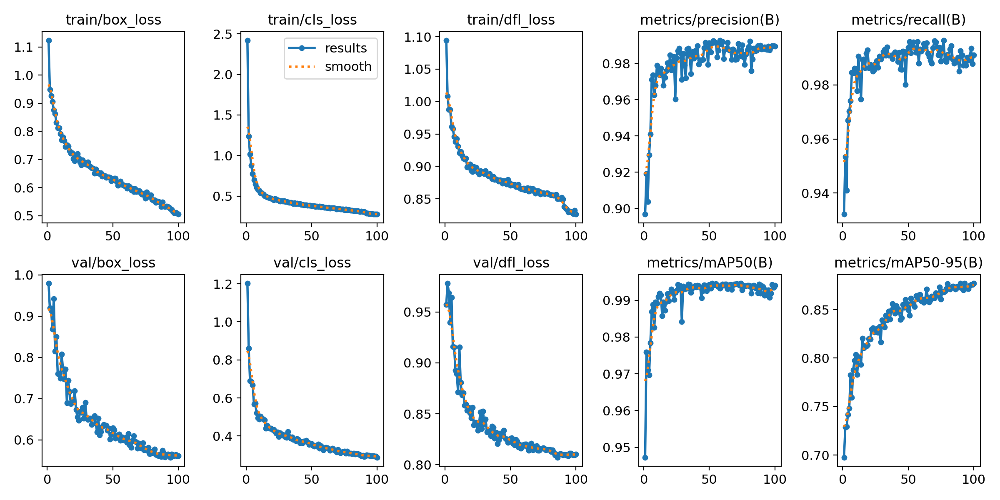

# info about models, datasets and authors

### df1.pt
https://universe.roboflow.com/sauvc-piqja/sauvc-finals/dataset/7

### df2.pt 
https://universe.roboflow.com/ntu-vi51k/sauvc-v3/dataset/7
finished on 39 epoch